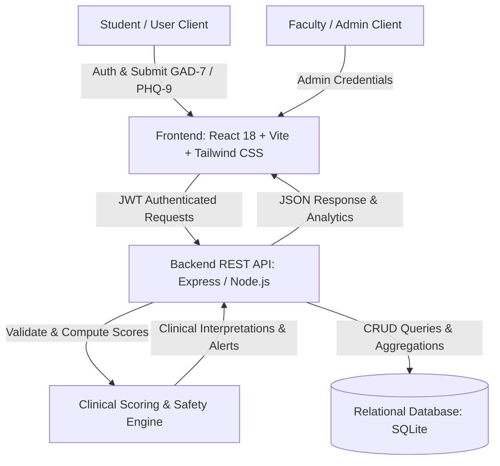

# Anxiety and Depression Screening System

An evidence-based, full-stack clinical screening and mental health monitoring web application developed for college project review and demonstration. The system integrates the clinically validated **GAD-7 (Generalized Anxiety Disorder 7-Item)** and **PHQ-9 (Patient Health Questionnaire 9-Item)** instruments with a responsive React frontend, an Express/Node.js REST API, an embedded relational SQLite database, automated scoring, longitudinal trend analytics, and administrative oversight.

---

## 1. Problem Statement
Mental health issues, particularly anxiety and depressive disorders, are increasingly prevalent among college students and young adults. However, hesitation, stigma, and lack of accessible baseline evaluation prevent many individuals from identifying symptoms early. 

The **Anxiety and Depression Screening System** addresses this problem by providing a confidential, accessible, and structured self-assessment platform. It empowers students to track their emotional health longitudinally, receive objective feedback according to standard clinical cutoffs, and immediately access professional crisis hotlines when distress is detected.

---

## 2. Key Features

### For Students / Users:
- **Evidence-Based Screening**: Complete the 7-item GAD-7 and 9-item PHQ-9 questionnaires with an intuitive 2-stage wizard.
- **Server-Side Clinical Scoring**: Objective, backend-computed scores with severity tier classifications (Minimal, Mild, Moderate, Moderately Severe, Severe).
- **Crisis Intervention Guard**: Automatic detection of distress on PHQ-9 Item 9 (*suicidal ideation/self-harm thoughts*), triggering immediate emergency helpline resources and safety advisories.
- **Interactive Longitudinal Dashboard**: Visual gauges, Chart.js progression charts tracking anxiety and depression levels across multiple dates, and recent screening summaries.
- **Detailed History & Breakdown**: Inspect past screenings, view exact question-by-question responses, and track improvement over time.
- **Printable Medical Summary**: One-click print / PDF export format optimized for sharing with campus counselors or physicians.
- **Personalized Wellness Strategies**: Practical evidence-based coping mechanisms (box breathing, behavioral activation, sleep hygiene).
- **Account Management**: Update user profile name and securely change passwords.

### For Administrators / Evaluators:
- **Role-Based Access Control**: Secure admin portal restricted to administrative credentials.
- **Population Analytics**: Live statistics on total users, total screenings conducted, average GAD-7 anxiety scores, and average PHQ-9 depression scores.
- **Severity Distribution Breakdown**: Visual distribution bars showing population percentages across Minimal, Mild, Moderate, and Severe categories.
- **Anonymized Screening Audit**: Review screening entries with anonymized student identifiers (`Student #102`) for data privacy compliance.
- **User Account Management**: View all registered users, their screening frequencies, and promote/demote user roles.

---

## 3. Technology Stack

| Layer | Technologies |
|---|---|
| **Frontend** | React 18, Vite, Tailwind CSS, React Router v6, Chart.js, react-chartjs-2, Lucide React |
| **Backend** | Node.js, Express.js (REST API, CORS, JSON parsing, logging) |
| **Database** | SQLite via `better-sqlite3` (WAL mode enabled, foreign key constraints) |
| **Authentication** | JSON Web Tokens (`jsonwebtoken`), Password Hashing (`bcryptjs`) |
| **Process Management** | `concurrently` (unified one-command startup for frontend & backend) |

---

## 4. System Architecture



---

## 5. Folder Structure

```
anxiety-depression-screening/
├── package.json               # Root scripts (concurrently launches full stack)
├── README.md                  # Complete documentation
├── .env.example               # Template environment configuration
├── backend/
│   ├── package.json
│   ├── .env                   # Backend environment configuration
│   ├── server.js              # Express app entrypoint & static build serving
│   ├── config/
│   │   └── database.js        # SQLite connection, WAL mode, schema migration
│   ├── controllers/
│   │   ├── authController.js       # Register, login, token verification
│   │   ├── screeningController.js  # Questions, evaluation, history, details
│   │   ├── dashboardController.js  # Trends and KPI calculation
│   │   ├── profileController.js    # Name and password updates
│   │   └── adminController.js      # Aggregate statistics and user management
│   ├── middleware/
│   │   ├── authMiddleware.js       # JWT Bearer token authentication guard
│   │   └── adminMiddleware.js      # Role-based access control guard
│   ├── services/
│   │   ├── scoringService.js       # GAD-7 & PHQ-9 clinical scoring rules
│   │   └── seedService.js          # Questions & demonstration user/admin seed
│   └── tests/
│       └── test_api.js             # Automated 16-step integration test suite
└── frontend/
    ├── package.json
    ├── vite.config.js         # Proxy configuration for development
    ├── tailwind.config.js     # Healthcare palette & styling definitions
    ├── index.html
    └── src/
        ├── App.jsx            # Router and Route Guards
        ├── main.jsx
        ├── index.css          # Tailwind directives & print styles
        ├── context/
        │   └── AuthContext.jsx # Auth state, login/logout, JWT storage
        ├── services/
        │   └── api.js         # API client with Bearer token interceptor
        ├── components/
        │   ├── Navbar.jsx      # Responsive header navigation
        │   ├── Footer.jsx      # Medical disclaimer and crisis helplines
        │   ├── ProtectedRoute.jsx
        │   ├── AdminRoute.jsx
        │   ├── ScoreGauge.jsx  # Visual severity meters
        │   ├── CrisisModal.jsx # Emergency crisis intervention popup
        │   └── TrendChart.jsx  # Chart.js longitudinal score graph
        └── pages/
            ├── LandingPage.jsx   # Public awareness, instruments, CTAs
            ├── LoginPage.jsx     # Login with demo quick-fill buttons
            ├── RegisterPage.jsx  # Registration with password strength meter
            ├── DashboardPage.jsx # Overview, latest scores, charts, tips
            ├── ScreeningPage.jsx # 2-part screening wizard (GAD-7 & PHQ-9)
            ├── ResultsPage.jsx   # Results, score breakdown, recommendations
            ├── HistoryPage.jsx   # Longitudinal table and trend chart
            ├── ProfilePage.jsx   # User settings and password change
            └── AdminPage.jsx     # Faculty/Admin analytics & user manager
```

---

## 6. Database Design

The database schema utilizes relational tables with foreign keys and cascaded deletions:

```sql
-- 1. Users Table
CREATE TABLE users (
  id INTEGER PRIMARY KEY AUTOINCREMENT,
  name TEXT NOT NULL,
  email TEXT UNIQUE NOT NULL,
  password_hash TEXT NOT NULL,
  role TEXT NOT NULL DEFAULT 'user', -- 'user' or 'admin'
  created_at DATETIME DEFAULT CURRENT_TIMESTAMP,
  updated_at DATETIME DEFAULT CURRENT_TIMESTAMP
);

-- 2. Questions Table (Standardized GAD-7 & PHQ-9 Items)
CREATE TABLE questions (
  id INTEGER PRIMARY KEY AUTOINCREMENT,
  code TEXT UNIQUE NOT NULL,         -- e.g. 'GAD7_1', 'PHQ9_9'
  questionnaire_type TEXT NOT NULL,  -- 'GAD-7' or 'PHQ-9'
  question_text TEXT NOT NULL,
  question_order INTEGER NOT NULL,
  category TEXT NOT NULL             -- 'Anxiety' or 'Depression'
);

-- 3. Screenings Table (Master Screening Sessions)
CREATE TABLE screenings (
  id INTEGER PRIMARY KEY AUTOINCREMENT,
  user_id INTEGER NOT NULL,
  screening_date DATETIME DEFAULT CURRENT_TIMESTAMP,
  anxiety_score INTEGER NOT NULL,
  anxiety_category TEXT NOT NULL,
  depression_score INTEGER NOT NULL,
  depression_category TEXT NOT NULL,
  requires_safety_alert INTEGER DEFAULT 0,
  notes TEXT,
  created_at DATETIME DEFAULT CURRENT_TIMESTAMP,
  FOREIGN KEY (user_id) REFERENCES users(id) ON DELETE CASCADE
);

-- 4. Responses Table (Individual Item Answers)
CREATE TABLE responses (
  id INTEGER PRIMARY KEY AUTOINCREMENT,
  screening_id INTEGER NOT NULL,
  question_id INTEGER NOT NULL,
  answer_value INTEGER NOT NULL,      -- 0, 1, 2, 3
  answer_label TEXT NOT NULL,        -- 'Not at all', etc.
  FOREIGN KEY (screening_id) REFERENCES screenings(id) ON DELETE CASCADE,
  FOREIGN KEY (question_id) REFERENCES questions(id) ON DELETE CASCADE
);
```

---

## 7. Clinical Scoring & Interpretation

All questions are scored on a standardized 4-point Likert scale assessing symptoms over the past 2 weeks:
- **0**: Not at all
- **1**: Several days
- **2**: More than half the days
- **3**: Nearly every day

### GAD-7 (Generalized Anxiety Disorder 7-Item)
- **Score Range**: 0 to 21
- **0 – 4**: Minimal Anxiety
- **5 – 9**: Mild Anxiety
- **10 – 14**: Moderate Anxiety (Clinical evaluation recommended)
- **15 – 21**: Severe Anxiety (Active clinical assessment strongly encouraged)

### PHQ-9 (Patient Health Questionnaire 9-Item)
- **Score Range**: 0 to 27
- **0 – 4**: Minimal Depression / None-Minimal
- **5 – 9**: Mild Depression
- **10 – 14**: Moderate Depression
- **15 – 19**: Moderately Severe Depression
- **20 – 27**: Severe Depression

### Crisis Safety Alert Protocol (PHQ-9 Item 9)
Item 9 assesses: *"Thoughts that you would be better off dead, or of hurting yourself in some way"*. If a user selects any non-zero value (1, 2, or 3) on Item 9, or scores in the severe depression tier:
1. `requires_safety_alert` is set to `1` in the database.
2. The UI immediately displays a prominent, supportive Emergency Support banner.
3. The 24/7 crisis helpline modal automatically opens with contact details for Tele-MANAS, Vandrevala Foundation, Kiran, and 988.

---

## 8. Installation & Setup

### Prerequisites
- Node.js v18+ (tested on Node v22.21.1)
- npm v9+

### Step-by-Step Installation:
1. Open a terminal in the project directory:
   ```bash
   cd "C:\Users\Ilakiya R\.gemini\antigravity\scratch\anxiety-depression-screening"
   ```

2. Install root dependencies:
   ```bash
   npm install
   ```

3. Install backend dependencies:
   ```bash
   cd backend && npm install && cd ..
   ```

4. Install frontend dependencies:
   ```bash
   cd frontend && npm install && cd ..
   ```

---

## 9. How to Run the Application

### Option A: Unified One-Command Run (Recommended for Demo)
From the project root directory, run:
```bash
npm run dev
```
This concurrently starts:
- The Express Backend API on `http://localhost:5000`
- The React Vite Frontend on `http://localhost:5173`

### Option B: Run Individually
- **Run Backend**:
  ```bash
  npm run backend
  # or: node backend/server.js
  ```
- **Run Frontend**:
  ```bash
  npm run frontend
  ```

### Option C: Production Single-Port Serving
The frontend has already been built into `frontend/dist`. Running only the backend server:
```bash
node backend/server.js
```
serves the entire full-stack application and API at **`http://localhost:5000`**.

---

## 10. Automated Testing

To run the automated 16-step end-to-end API test suite:
```bash
npm test
# or: node backend/tests/test_api.js
```
The test suite validates:
1. System Health Endpoint
2. Demo User Authentication
3. Invalid Password Rejection (401)
4. New User Registration (201)
5. Duplicate Email Prevention (409 Conflict)
6. Route Protection Guard (401 Unauthorized)
7. GAD-7 & PHQ-9 Questions Retrieval
8. Server-Side Clinical Score Calculation (Minimal Anxiety & Depression)
9. PHQ-9 Item 9 Crisis Safety Alert Trigger
10. Single Screening Record Audit with 16 Item Responses
11. Cross-User Privacy Guard (403 Forbidden on Unauthorized Access)
12. Dashboard KPIs & Longitudinal Trend Points
13. User Profile Update
14. Regular User Restriction from Admin Endpoints (403 Forbidden)
15. Administrator Login & Population Analytics Access
16. Admin User Management List Retrieval

---

## 11. Demonstration Accounts & Credentials

For fast demonstration during college project reviews, the login page includes **Quick-Fill Demo Buttons**:

| Role | Email | Password | Pre-seeded Data |
|---|---|---|---|
| **Student / User** | `demo@student.edu` | `DemoUser@123` | Pre-seeded with 3 historical screenings across past dates to demonstrate trend charts immediately |
| **System Admin** | `admin@screening.org` | `AdminPass@123` | Full access to population metrics, severity distributions, and user management |

You can also register any new account freely on the Registration page.

---

## 12. API Reference Overview

### Authentication
- `POST /api/auth/register` - Create new student account
- `POST /api/auth/login` - Authenticate and receive JWT token
- `GET /api/auth/me` - Get current session user

### Screenings
- `GET /api/screenings/questions` - Fetch standardized GAD-7 and PHQ-9 questions
- `POST /api/screenings` - Submit answers; server calculates scores and saves records
- `GET /api/screenings` - Get historical screenings for logged-in user
- `GET /api/screenings/:id` - Get full details and item-by-item responses for a specific screening

### Dashboard & Profile
- `GET /api/dashboard` - Get KPI summary, latest scores, and trend coordinates
- `GET /api/profile` - Get user profile details
- `PUT /api/profile` - Update user name
- `PUT /api/profile/password` - Change user password

### Administration (Requires Admin Role)
- `GET /api/admin/statistics` - Population KPI summary, severity distributions, anonymized screening logs
- `GET /api/admin/users` - List all registered users and screening counts
- `PUT /api/admin/users/:id/role` - Toggle user role between 'user' and 'admin'

---

## 13. Limitations & Future Scope
- **Screening, Not Diagnostic**: The system is designed for self-assessment and symptom tracking, not formal clinical diagnosis.
- **Self-Report Bias**: Results depend on the honesty and self-awareness of the respondent.
- **Future Enhancements**: Integrating automated email alerts to campus health counselors (with consent), multi-language questionnaire translations, and SMS crisis hotline dispatch.

---

## 14. Ethical & Medical Disclaimer
> **IMPORTANT**: The Anxiety and Depression Screening System is an educational and screening aid. It is **NOT** a substitute for clinical diagnosis, psychiatric consultation, or medical treatment. If you or someone you know is in crisis or experiencing suicidal thoughts, please call an emergency helpline immediately:
> - **Tele-MANAS (India)**: `14416` or `1800 891 4416` (24/7 Toll-Free)
> - **Kiran Mental Health**: `1800-599-0019`
> - **Vandrevala Foundation**: `+91 9999 666 555`
> - **US / Canada Crisis Lifeline**: `988`
> - **Emergency Services**: `112` / `911`
